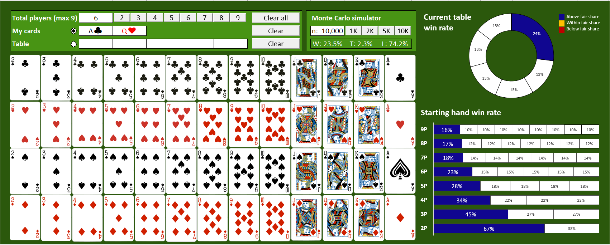
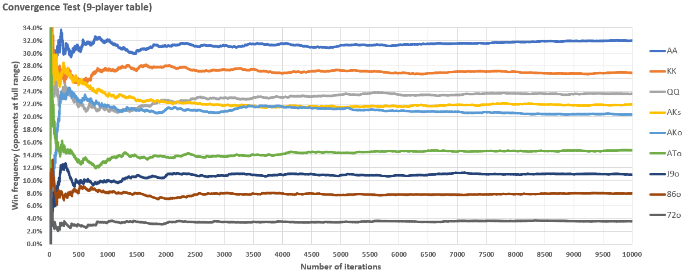

# PokerMonteCarlo
Simple Monte-Carlo based hand evaluation tool for Texas Hold'em Poker on Excel. Comes with pre-loaded starting hand win probability for tables from 2 to 9 players. Other hand-board card combinations are calculated on the go.

## Prerequisites and installation
Microsoft Excel is necessary. Just download Poker Odds Calculator MC.xlsm and start using it.

## Main features
* Pre-calculated, Monte-Carlo based, win probability  for all starting hand combinations
* Hand & board win probability
* Scenarios for 2 to 9 player tables
* Quick and easy interface to speed up scenario simulations

## How to use
1. Select the number of active players on your scenario
1. Select your cards
1. Select the board cards (optional)
1. Select the number of Monte-Carlo simulations to run
1. Run simulations
1. Check you Win-Tie-Loss probability distribution and compare it against the table's fair share (1/nPlayers)
1. Bet according to your odds-based strategy

## Simulating on Monte Carlo, how many simulations is enough?
Monte-Carlo-based solutions usually rely on a large number of simulations to generate realiable information. This project is made on Excel and uses VBA, a relatively slow programming language. To improve efficiency, a convergence test was made to determine the lowest possible number of simulations that give trustable results.

It is safe to assume that, for 1500 simulations or higher, you will be within 2 percentual points of fluctuation, which is fairly sufficient for Poker estimates. Anything above 10000 is overkill.

## About me
I'm Danilo Vilardi, a Brazilian mechanical engineer with 10+ different hobbies and no time to pursue them all: programmer, photographer, electronic and woodwork dyi adventurer, musician and ocasional CS gaming.
I'm social on:
* [Linkedin](https://www.linkedin.com/in/danilo-vilardi/)
* [Instagram](https://www.instagram.com/dvilardi/)

## Acknowledgments
Most of the poker logics (hand evaluation and scoring) was based on this java-based project by Dr Shun Yan Cheung from Emory College of Arts and Sciences: http://www.mathcs.emory.edu/~cheung/Courses/170/Syllabus/10/pokerCheck.html
